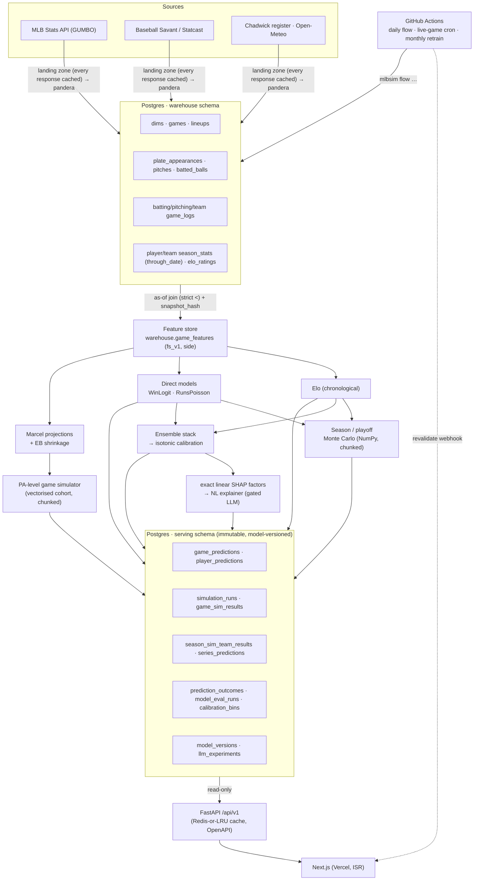

# System Architecture

## 1. Guiding decision — simulation first

The platform must produce roughly 60 distinct prediction outputs (win probability, score
distribution, runs by inning, P(shutout), per-batter P(2+ hits), pitcher strikeout
distributions, extra-inning probability, series-length distributions, and so on). Training
a separate model per target is a maintenance and consistency problem: independent models
disagree with each other (the P(shutout) model contradicts the expected-runs model), and
every new target adds a new leakage surface.

Instead the system centres on **one plate-appearance-level Monte Carlo game engine**.
Every downstream number is a read-off from simulated games:

- `P(shutout) = mean(sim_runs_allowed == 0)`
- runs-by-inning = histogram over simulated innings
- a batter's `P(2+ hits)` = his hit count across N simulated lineups

This guarantees internal consistency, produces full distributions for free, and turns
"add a new stat" into a query rather than a modelling project.

The engine needs only four learned components:

| Component | Predicts | Model progression |
|---|---|---|
| Event model | Multinomial over PA outcomes `{field_out, K, BB, HBP, 1B, 2B, 3B, HR}` for batter × pitcher × context | log5 / odds-ratio baseline → gradient-boosted multinomial → NN with player embeddings |
| Baserunning | Base/out state transition given event | Empirical transition matrix from Retrosheet; optional small model |
| Bullpen | Reliever entering given inning / score / leverage / pitch count | Rule-based usage model + reliever-specific event rates |
| Projections | Player true-talent rates that prior the event model | Marcel baseline → hierarchical Bayes partial pooling |

Alongside the simulator is a **fast direct path** — Elo, logistic regression,
Poisson / negative-binomial GLM, and a GBM — that returns a game win probability and a run
distribution in microseconds. The 100,000-season Monte Carlo consumes the fast path
because running the full PA engine 100k x 2,430 games is intractable. The PA engine is
reserved for game-page deep dives and for **calibrating** the fast path.

An **ensemble stacker** blends simulator and direct-path probabilities; **isotonic
calibration** produces the final published probability. If the calibrated simulator alone
beats the stack out-of-sample, that is what ships, and the finding is documented.

## 2. Data flow



**Key invariant:** the API never runs a model. The pipeline writes immutable prediction
rows (each carrying `model_id` + `created_at`); the API and frontend only read. This makes
prediction history, model versioning, and "what did the model predict yesterday?" trivial
and keeps request latency flat.

## 3. Deployment topology

| Component | Host | Notes |
|---|---|---|
| Postgres | Supabase | managed, dashboard, free tier; connection pooling via PgBouncer |
| FastAPI | Render | web service; autodeploy from `main`; Redis add-on for cache |
| Frontend | Vercel | Next.js App Router; ISR + on-demand revalidation webhook |
| Orchestration | GitHub Actions | `daily-pipeline.yml` (cron), `live-games.yml` (cron in game windows), `nightly-train.yml` (monthly) |
| Model artifacts | Supabase Storage / S3-compatible bucket | referenced by `model_versions.artifact_uri`; never stored in the DB |
| Raw data landing | Parquet in object storage + local cache | Statcast bulk stays out of Postgres |

## 4. Hard engineering problems

1. **Point-in-time correctness (the crux).** One blessed `asof.py` join primitive that
   every feature builder must use; property-based tests asserting a feature "as of date D"
   never changes when future rows are added; a `data_snapshot_hash` on every feature row
   (hash of contributing source row IDs + max source timestamp) that CI reproduces.
2. **Simulator performance.** A pure-Python PA loop is orders of magnitude too slow.
   Vectorised cohort simulation in NumPy where possible; the hot loop in Numba (`@njit`);
   a CI benchmark gate (10k game-sims must stay under a wall-clock target). Rust / PyO3 is
   the fallback if Numba plateaus.
3. **100k-season memory.** Never materialise the full seasons x games x outcomes tensor.
   Chunk seasons (e.g. 5,000 at a time), use `int8` / `int16` arrays, aggregate online
   (running counts of playoff berths, win distributions).
4. **ID crosswalk.** MLBAM ↔ Retrosheet ↔ FanGraphs ↔ Baseball-Reference. Chadwick Bureau
   register is source of truth; `players` holds all four IDs; a nightly reconciliation job
   flags unmatched players.
5. **Retrosheet ingestion.** Idiosyncratic event-file format, ~1-year release lag. Parse
   with `chadwick` (`cwevent`) to CSV → `plate_appearances`. 2025+ PA data comes from the
   Stats API play-by-play instead (different parser, same target schema).
6. **MLB Stats API politeness.** No official bulk SLA. Raw-response landing zone,
   exponential-backoff retries, conditional requests, a nightly full-schedule reconcile to
   catch missed updates.
7. **Live game latency (M9).** GUMBO updates every ~10–20 s. A dedicated live-game flow
   polls active games, recomputes win probability from a lightweight state model
   (base/out/score/inning/pitcher fatigue), writes a new `game_predictions` row with
   `is_live = true` + `game_state_json`, then pings the Vercel revalidation webhook.
8. **Reproducibility across a live season.** Monthly retrains must not orphan past
   predictions. MLflow model registry, immutable prediction rows, `git_sha` on every
   `model_version`, content-addressed Parquet snapshots of training data.
9. **Calibration drift.** A model calibrated on 2024 can drift by mid-2026. Scheduled
   monthly recalibration on a trailing window; ECE tracked on `/model` with a threshold
   alert.
10. **Cost containment.** Statcast backfills are gigabytes — keep raw in Parquet, load
    only modelled columns into Postgres; free tiers for Render, Vercel, Supabase; GitHub
    Actions minutes for orchestration.

## 5. Repository structure

uv workspace monorepo (also installable with plain `pip`/`venv`). No package imports
another's internals — only its public API. `notebooks/` is never imported by package code.
CI runs `ruff`, `mypy --strict`, and `pytest` for every package, plus an offline
migration-SQL check and a real upgrade/downgrade against a Postgres service container.
A seventh package, `mlbsim-core`, holds cross-cutting foundations (settings, DB session,
logging) that every other package depends on.

```
mlbplayoffs2026/
├── pyproject.toml                  uv workspace root
├── docker-compose.yml              postgres + redis + api (local dev)
├── Makefile                        up / migrate / backfill / predict / test
├── .github/workflows/
│   ├── ci.yml                      lint, type-check, unit + integration, sim benchmark gate
│   ├── daily-pipeline.yml          ingest → features → predict → simulate → publish → revalidate
│   ├── live-games.yml              `mlbsim flow live` — cron every ~10 min during game windows
│   └── nightly-train.yml           monthly `train` + `ensemble train` (recalibrate) + `evaluate`
├── configs/                        hydra / yaml: data, features, models/, sim, pipeline
├── docs/                           ARCHITECTURE, DATABASE, DATA_SOURCES, MODELING, EVALUATION, ROADMAP, adr/, diagrams/
├── packages/
│   ├── mlbsim-core/src/mlbsim_core/
│   │   ├── config.py               typed settings (pydantic-settings, MLBSIM_ env prefix)
│   │   ├── db.py                   SQLAlchemy Base + engine + session_scope; logical schemas
│   │   └── logging.py              structlog configuration
│   ├── mlbsim-data/src/mlbsim_data/
│   │   ├── models/                 ORM tables — source of truth for the DB schema
│   │   ├── sources/                http.py mlb_statsapi.py chadwick.py (statcast/weather next)
│   │   ├── parse/                  pure JSON→row-dict parsers (schedule, feed, boxscore)
│   │   ├── validate/               pandera schemas (games, plate_appearances, batting logs)
│   │   ├── loaders/                upsert.py + warehouse.py (entity upserts)
│   │   ├── ingest.py               fetch→parse→validate→load orchestration
│   │   ├── query.py                read-side helpers (backs `mlbsim query`)
│   │   └── crosswalk.py            Chadwick player-ID reconciliation
│   │   # landing zone lives on disk under data/landing/, not in the package
│   ├── mlbsim-features/src/mlbsim_features/
│   │   ├── asof.py                 the one blessed point-in-time join
│   │   ├── team.py pitcher.py batter.py park.py context.py form.py
│   │   └── registry.py             feature-set spec, versioning, snapshot hash
│   ├── mlbsim-models/src/mlbsim_models/
│   │   ├── ratings/                elo.py glicko.py
│   │   ├── event/                  log5.py gbm.py nn.py
│   │   ├── direct/                 win_logit.py runs_poisson.py runs_nb.py gbm.py
│   │   ├── projections/            marcel.py bayes_hier.py
│   │   ├── ensemble/               stack.py calibrate.py
│   │   ├── explain/                shap_runner.py nl_explainer.py
│   │   ├── llm/                    finetune/ eval/
│   │   ├── registry.py             MLflow wrapper
│   │   └── evaluate/               metrics.py backtest.py calibration.py baselines.py
│   ├── mlbsim-engine/src/mlbsim_engine/
│   │   ├── game.py                 PA-level engine (@njit hot loop)
│   │   ├── baserunning.py bullpen.py fatigue.py
│   │   ├── season.py               vectorised season Monte Carlo
│   │   ├── playoffs.py             seeding, tiebreakers, bracket, series
│   │   └── bench/                  pytest-benchmark suites
│   ├── mlbsim-pipeline/src/mlbsim_pipeline/
│   │   ├── flows/                  _run.py (guarded step-runner) daily.py live.py status.py
│   │   └── cli.py                  `mlbsim <verb>` entrypoint (incl. `mlbsim flow daily|live|status`)
│   └── mlbsim-api/src/mlbsim_api/
│       ├── main.py deps.py cache.py
│       ├── routers/               games teams players playoffs standings models predictions sims
│       └── schemas/               pydantic response models
├── db/alembic.ini + migrations/versions/
├── web/                            Next.js — see docs/ARCHITECTURE.md §7
├── notebooks/                      exploratory only
└── tests/                          unit/ integration/ fixtures/
```

## 6. API surface

FastAPI, REST, versioned `/api/v1`, read-only over serving tables, Redis cache with short
TTL + ETag, auto OpenAPI. TS types generated for the frontend via `openapi-typescript`
(CI checks they are in sync).

| Method & path | Returns |
|---|---|
| `GET /games?date=&team=&status=` | games for a date with their latest pre-game prediction summary |
| `GET /games/{game_pk}` | full bundle: teams, probables, win prob, predicted score, expected runs, score distribution, P(shutout)/P(one-run)/P(extra), most-likely scores, factors |
| `GET /games/{game_pk}/innings` | inning-by-inning expected runs + P(score 1+/2+/3+) + P(lead after) for both teams |
| `GET /games/{game_pk}/players` | batter + pitcher projections: point estimates, prop probabilities, distributions |
| `GET /games/{game_pk}/simulation` | sim run summary: n_sims, win %, score grid/heatmap, run-diff distribution, extra-inning %, runtime |
| `GET /games/{game_pk}/live` | latest `is_live` prediction + game state; 404 if not in progress (M9) |
| `GET /teams` · `GET /teams/{abbr}` | record, ratings (off / pitch / pen / overall), playoff / division / WS probabilities, projected final record, strength of schedule, recent form |
| `GET /teams/{abbr}/schedule` | past results + upcoming games with predictions |
| `GET /players/{player_id}` | current stats, advanced metrics, next-game projection, rolling prediction history, accuracy vs actuals |
| `GET /standings?date=` | actual + projected standings |
| `GET /playoffs` | current field, projected bracket, per-series probabilities, WS odds |
| `GET /playoffs/series/{series_id}` | series detail: win prob, expected games, P(sweep / 5 / 6 / 7) |
| `GET /simulations/season/latest` | all 30 teams' season-sim probabilities + win distributions |
| `GET /models` | registry: versions, kinds, headline metrics |
| `GET /models/{model_id}/evaluation` | full metrics, calibration bins, accuracy-over-time series |
| `GET /predictions/history?date=&team=&model=` | past predictions vs actuals; leaderboard aggregates |
| `GET /predictions/{pred_id}/explanation` | SHAP payload + NL text |
| `GET /healthz` · `GET /version` | ops |

Optional guarded `POST /internal/recompute` (bearer token) for manual pipeline triggers.
Rate limiting via `slowapi`. No user auth — public read-only product.

## 7. Frontend architecture

Next.js (App Router), TypeScript, Tailwind CSS, Recharts, shadcn/ui.

- **Server Components** fetch from FastAPI server-side with `revalidate` (ISR).
  **Client Components** only for interactive charts and the live-game view.
- Pipeline calls a Vercel on-demand revalidation webhook after each run, so pages update
  without waiting for the ISR window.
- Live game page (M9): client component polling `/games/{id}/live` every ~20 s.
- `lib/api.ts` — typed fetch client; `lib/types.ts` generated from the OpenAPI schema.
- Filters in URL search params; polling pages use TanStack Query.
- `components/charts/`: `WinProbChart`, `ScoreHeatmap`, `RunDistBar`, `InningRunsTable`,
  `CalibrationPlot`, `PredVsActualScatter`, `WSOddsBar`, `Bracket`, `TeamTrajectoryChart`,
  `PlayerPropChart`.
- Routes: `/` · `/games` · `/games/[gamePk]` · `/teams` · `/teams/[abbr]` ·
  `/players/[playerId]` · `/standings` · `/playoffs` · `/predictions` · `/model`.
- Dark mode, responsive, accessible; small design-token system.
- Deploy: Vercel; `NEXT_PUBLIC_API_URL` → Render backend.
